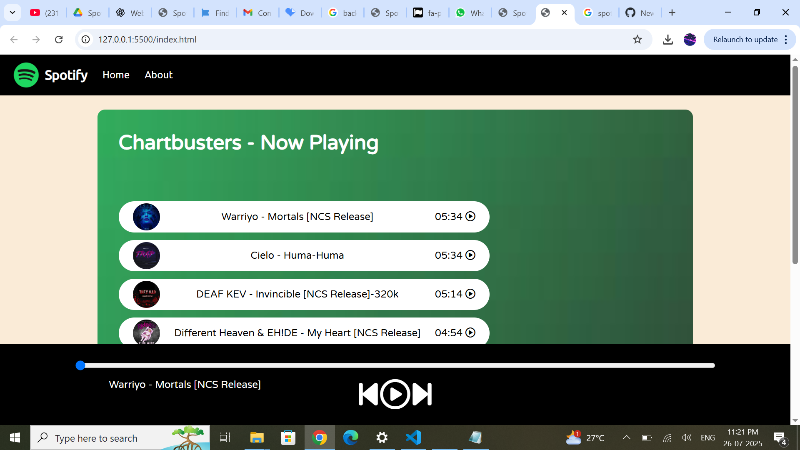

# 🎧 Spotify Clone - HTML, CSS & JavaScript

A responsive and interactive **Spotify Clone** built using pure HTML, CSS, and JavaScript. This is a frontend-only project that simulates a basic music player with all core functionalities like play/pause, next/previous, and song switching — wrapped in a clean, modern UI.

---

## 📸 Preview

---

## 🚀 Features

- 🎵 Play/Pause selected songs  
- ⏭️ Next and Previous buttons  
- 🟢 Animated GIF while music plays  
- 🧭 Seek bar with real-time progress tracking  
- 🖼 Dynamically updated song names and thumbnails  
- 📱 Responsive design (mobile-friendly)

---

## 🛠 Technologies Used

- **HTML5** – Structure of the app  
- **CSS3** – Styling and layout  
- **JavaScript (Vanilla)** – Audio control and interactivity  
- **Font Awesome** – Icons for play, pause, etc.  
- **Google Fonts** – Varela Round and Ubuntu for typography  

---

## 📁 Folder Structure

